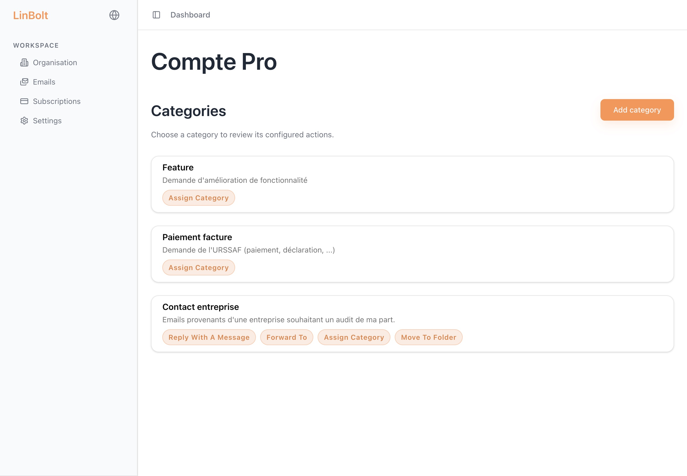
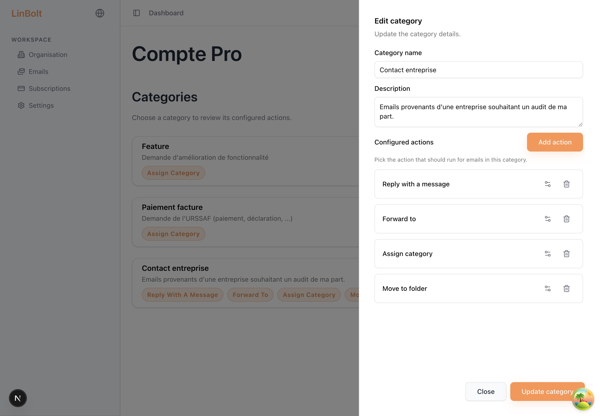
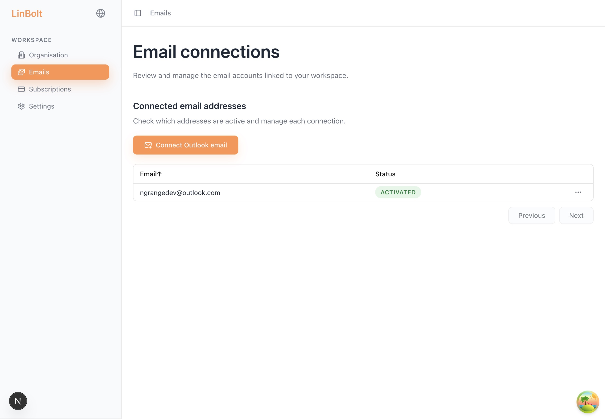

# SAAS Email Classifier

A powerful full-stack application designed to classify and manage emails efficiently. Built with modern web technologies, it integrates seamlessly with Microsoft 365 and offers a robust set of features for email automation.


## 🚀 Features

- **Smart Email Classification**: Automatically categorize incoming emails.
- **Microsoft 365 Integration**: Connect directly to your Outlook account using Microsoft Graph.
- **Custom Actions**: Define actions based on email classification.
- **User Management**: Secure authentication and user management via Supabase.
- **Subscription Management**: Integrated Stripe payments for premium features.
- **Responsive Design**: Beautiful, mobile-friendly interface built with TailwindCSS and Shadcn UI.

## 📸 Screenshots

| Configuration | Actions | Emails |
|:---:|:---:|:---:|
|  |  |  |

## 🛠️ Tech Stack

### Frontend
- **Framework**: [Next.js 15](https://nextjs.org/)
- **Language**: [TypeScript](https://www.typescriptlang.org/)
- **Styling**: [TailwindCSS](https://tailwindcss.com/) & [Shadcn UI](https://ui.shadcn.com/)
- **State Management**: [Tanstack Query](https://tanstack.com/query/latest)
- **Auth**: [Supabase](https://supabase.com/)

### Backend
- **Framework**: [NestJS](https://nestjs.com/)
- **Language**: [TypeScript](https://www.typescriptlang.org/)
- **Database**: [PostgreSQL](https://www.postgresql.org/) (via Supabase)
- **ORM**: [TypeORM](https://typeorm.io/)
- **API**: REST (Fastify adapter)

## 🏁 Getting Started

### Prerequisites
- Node.js (v20+)
- Yarn or npm
- Supabase account
- Microsoft Azure App (for Graph API)
- Stripe account

### Installation

1. **Clone the repository**
   ```bash
   git clone https://github.com/NoeGRANGE/email-classifier
   cd email-classifier
   ```

2. **Install Frontend Dependencies**
   ```bash
   cd front
   yarn install
   ```

3. **Install Backend Dependencies**
   ```bash
   cd ../back
   yarn install
   ```

4. **Environment Setup**
   - Create `.env` files in both `front` and `back` directories based on `.env.example`.

### Running the App

**Frontend**
```bash
cd front
yarn dev
```

**Backend**
```bash
cd back
yarn dev
```

## 📂 Project Structure

- `/front`: Next.js frontend application
- `/back`: NestJS backend API
- `{external}`: External VM with hosted LLM

## 👨‍💻 Author

- GitHub: [@NoeGRANGE](https://github.com/NoeGRANGE)
- LinkedIn: [Noé Grange](https://www.linkedin.com/in/noé-grange-b120a9235)
- Mail: [ngrange@grangeco.app](mailto:ngrange@grangeco.app)
